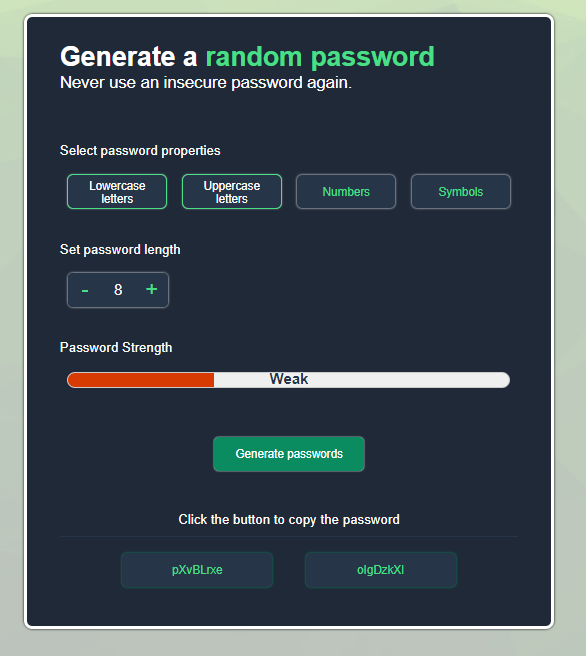
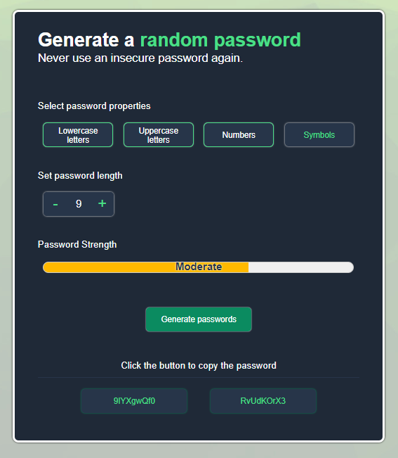
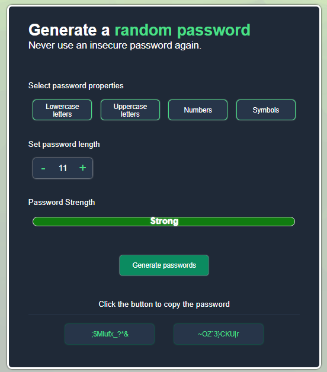

# Password Generator

## Description

The Password Generator is a powerful tool that allows users to generate random, secure passwords with customizable options. This project is built using React and provides a user-friendly interface for generating passwords based on selected criteria.

## Features

- Generate random passwords based on selected criteria:
  - Lowercase letters
  - Uppercase letters
  - Numbers
  - Symbols
- Adjustable password length
- Password strength meter
- Generate two random passwords at a time.
- Copy passwords to the clipboard

## Demo

You can try out the live demo of the Password Generator [here](https://passgenrator.netlify.app/).

## Screenshots

## Installation

1. Extract the contents of the zip file to a directory of your choice.

2. Open a terminal and navigate to the project directory:

cd path/to/password-generator

3. Install the dependencies:

npm install

4. Start the development server:

npm run dev

5. Access the Password Generator in your browser at `http://127.0.0.1:5173/`.

## how to use the password generator code in other projects:

1. Copy the `src` directory and paste it into your existing React project's directory.

2. Import the `Passgen` component from the copied `src` directory into your desired file:

import Passgen from './src/Passgen';

3. Use the Passgen component in your JSX code to include the Password Generator in your project:

function MyComponent() {
  return (
    

      {/* Your existing code */}
      <Passgen />
      {/* Your existing code */}
    

  );
}

4. Customize the appearance and behavior of the Password Generator by modifying the code in the src directory.

## Usage

1. Select the desired password criteria by clicking on the corresponding buttons (lowercase letters, uppercase letters, numbers, symbols).

2. Adjust the password length using the "+" and "-" buttons.

3. The password strength meter will indicate the strength level of the generated password.

4. Click the "Generate passwords" button to generate two random passwords based on the selected criteria and length.

5. Copy the desired password by clicking on the corresponding password button.

6. Use the copied password wherever needed.

## Customization

You can customize the appearance and behavior of the Password Generator by modifying the code in the `src` directory.

## Support

If you have any questions, issues, or feature requests,contact me at [p2techstudio@gmail.com].

## Credits

- [React](https://reactjs.org/)

